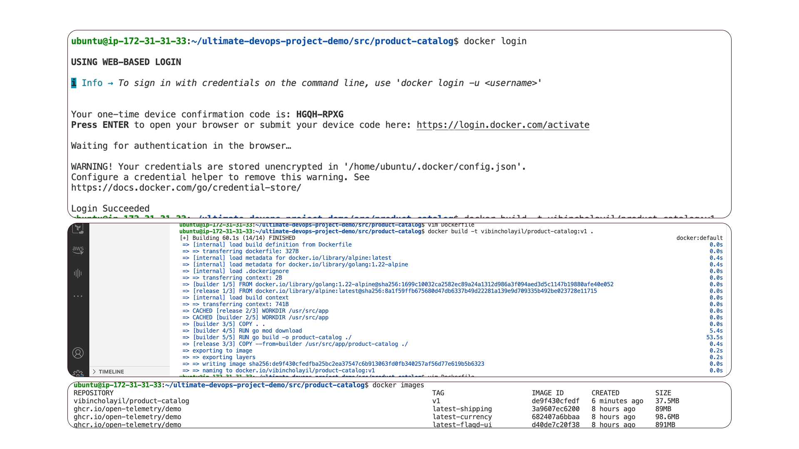

# E-commerce microservice project
This is a end-to-end DevOps Implementation on a Multi-Microservice E-Commerce opentelemetry project

### Introduction 
This project is a demostration of real-time DevOps implementation using a highly popular E-Commerce project open-sourced by OpenTelemetry. This project is widely recognized as one of the best real-world applications for DevOps, and I personally believe it offers the most practical insights.  

## Cloud Infrastructure Setup – configure and deploy server and install Docker, Kubernetes, Terraform.
### Create an EC2 Instance  

I have use ec2 instance with ubuntu image 24.04 t2.medium  (ie: 2vCPU 8 GiB Memory)
```
chmod 400 .pem
ssh -i .pem ubuntu@<ip-address>
```
### Install Docker
Add Docker's official GPG key:  
```
sudo apt-get update
sudo apt-get install ca-certificates curl
sudo install -m 0755 -d /etc/apt/keyrings
sudo curl -fsSL https://download.docker.com/linux/ubuntu/gpg -o /etc/apt/keyrings/docker.asc
sudo chmod a+r /etc/apt/keyrings/docker.asc
```
Add the repository to Apt sources:  
```
echo \
  "deb [arch=$(dpkg --print-architecture) signed-by=/etc/apt/keyrings/docker.asc] https://download.docker.com/linux/ubuntu \
  $(. /etc/os-release && echo "${UBUNTU_CODENAME:-$VERSION_CODENAME}") stable" | \
  sudo tee /etc/apt/sources.list.d/docker.list > /dev/null
sudo apt-get update
```
Install Docker  
```
sudo apt-get install docker-ce docker-ce-cli containerd.io docker-buildx-plugin docker-compose-plugin
```
Verify Docker Installation  
```
sudo docker run hello-world
```
(optional) create docker group
```
sudo usermod -aG docker ubuntu
```
(optional)check ubuntu user docker group
```
logout
ssh -i .pem ubuntu@<ip-address>
```
```
docker ps
docker images
```
### Kubectl Installation on Ubuntu EC2
Download kubectl  
```
curl -LO "https://dl.k8s.io/release/$(curl -L -s https://dl.k8s.io/release/stable.txt)/bin/linux/amd64/kubectl"
```
Install Kubectl
```
sudo install -o root -g root -m 0755 kubectl /usr/local/bin/kubectl
```
Verify Kubectl
```
kubectl version --client
```
### Install Terraform on Ubuntu EC2
Add Hashicorp repos  
```
sudo apt-get update && sudo apt-get install -y gnupg software-properties-common

wget -O- https://apt.releases.hashicorp.com/gpg | \
gpg --dearmor | \
sudo tee /usr/share/keyrings/hashicorp-archive-keyring.gpg > /dev/null

echo "deb [signed-by=/usr/share/keyrings/hashicorp-archive-keyring.gpg] \
https://apt.releases.hashicorp.com $(lsb_release -cs) main" | \
sudo tee /etc/apt/sources.list.d/hashicorp.list

sudo apt update
```  
Install Terraform  
```
sudo apt-get install terraform
```
Verify Terraform Installation  
```
terraform -help
```
## Try the project in local setup
I have used this project from github repo. for that i install git

clone  this repo:  
```
git clone https://github.com/iam-veeramalla/ultimate-devops-project-demo.git
```
get into the repo and try to do docker up  
```
docker compose up
```

#### [ERROR] because of the volume space issue
For increasing the volume i have follow below steps  
```
df -h
```
```
lsblk
```
i  
Increase the volume and let the 'volume state' to 'in-use'.  
then i run the command for resize the file sysytem
```
sudo apt install cloud-guest-utils
sudo resize2fs /dev/xvda1
```
Now the Volume is change to 30GB when i check the 'lsblk'  

Countinue my instalation  
```
docker compose up -d
```
for opening the project 
```
<ip-address>:8080
```


## Containerization with Docker – package and manage applications using Docker.
#### Product-Catlog service (Go lang) 
Follow readme file for bulding the binary localy in the machine  
```
export PRODUCT_CATALOG_PORT=8088
```
downloading dependencies and creating the build
```
go build -o product-catalog . 
```
```
./product-catalog
```
#### create Muilti build dockerimage for product-catalog
vim Dockerfile
```
FROM golang:1.22-alpine AS builder

WORKDIR /usr/src/app

COPY . .

RUN go mod download

RUN go build -o product-catalog ./

FROM alpine AS release

WORKDIR /usr/src/app
COPY ./products/ ./products/
COPY --from=builder /usr/src/app/product-catalog ./

#EXPOSE ${PRODUCT_CATALOG_PORT}
ENV PRODUCT_CATALOG_PORT=8088
ENTRYPOINT ["./product-catalog"]
```
#### Docker Build product-catalog
```
docker build -t vibincholayil/product-catalog:v1 .
```

#### Docker Container product-catalog
```
docker run vibincholayil/product-catalog:v1
```
Container running of product-catalog
#### Ad service (Gradle)
Follow readme file for bulding the binary localy in the machine  
#### install JDK and run the service
```
sudo apt install openjdk-21-jre-headless 
```
```
./gradlew installDist
```
```
export AD_PORT=8080
export FEATURE_FLAG_GRPC_SERVICE_ADDR=featureflagservice:50053
./build/install/opentelemetry-demo-ad/bin/Ad
```
#### create docker image for Ad service
```
RUN chmod +x ./gradlew
RUN ./gradlew
RUN ./gradlew downloadRepos

COPY . .

COPY ./pb ./proto
RUN chmod +x ./gradlew
RUN ./gradlew installDist -PprotoSourceDir=./proto

##########################################################

FROM eclipse-temurin:21-jre

WORKDIR /usr/src/app

COPY --from=builder /usr/src/app ./

ENV AD_PORT 9099

ENTRYPOINT ["./build/install/opentelemetry-demo-ad/bin/Ad"]

"Dockerfile" 29L, 530B                                                                                                                             24,16         Bot
```
build and run this ad service
```
docker build -t vibincholayil/adservice:v1 .
docker run vibincholayil/adservice:v1 
```
#### recommendation service (Python)
I have start writing dockerfile
##### Docker file for recommendation service
```
FROM python:3.12-slim-bookworm AS base

WORKDIR /usr/src/app

COPY requirements.txt ./

RUN pip install --upgrade pip
RUN pip install -r requirements.txt

COPY . .

ENTRYPOINT ["python", "recommendation_server.py"]
```
#### Build and Run
```
docker build -t vibincholayil/product-catalog:v1 .
docker run vibincholayil/recommendationservice:v1
```
#### push all images in my docker registry
```
docker push docker.io/vibincholayil/product-catalog:v2
docker push docker.io/vibincholayil/adservice:v1
docker push docker.io/vibincholayil/recommendationservice:v1
```
#### Docker Compose
i have the docker compose file
```
docke compose up -d
```
access frontant access
```
<ip-address>:8080
```
### Kubernetes for Orchestration – Deploy and manage containers at scale using Kubernetes.
#### create a eks cluster using Terraform


### Infrastructure as Code (IaC) with Terraform 
