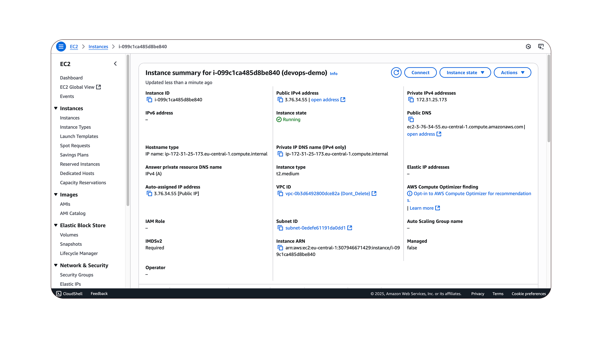

# E-commerce microservice project
This is a end-to-end DevOps Implementation on a Multi-Microservice E-Commerce opentelemetry project

### Introduction 
This project is a demostration of real-time DevOps implementation using a highly popular E-Commerce project open-sourced by OpenTelemetry. This project is widely recognized as one of the best real-world applications for DevOps, and I personally believe it offers the most practical insights.  

### Cloud Infrastructure Setup – configure and deploy a AWS cloud environment.
#### Create an EC2 Instance

### Understanding the Project & SDLC – Gain in-depth knowledge of software development lifecycles in microservices-based architectures.
### Containerization with Docker – Learn how to package and manage applications efficiently using Docker.
### Docker Compose Setup – Manage multi-container applications with Docker Compose.
### Kubernetes for Orchestration – Deploy and manage containers at scale using Kubernetes.
### Infrastructure as Code (IaC) with Terraform 
